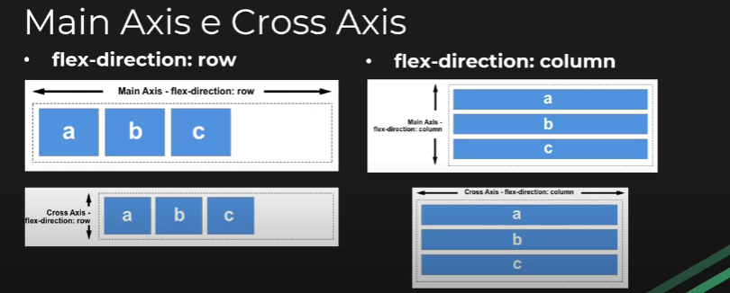

# FlexBox

## O que é Flexbox?
* Flexible Box Model
* Aplicamos com display: flex
* Organização dos nossos layouts se torna mais flexível e dinâmica
* Por padrão, todos os itens do container ficam lado a lado
* Grande capacidade de responsividade

## Main Axis e Cross Axis (eixo principal e eixo transversal)
* flex-direction: row
    - Main Axis: eixo horizontal
    - Cross Axis: eixo vertical
* flex-direction: column
    - Main Axis: eixo vertical
    - Cross Axis: eixo horizontal
* Esquema:


## FLEX CONTAINER PROPS
* `flex-direction`: fluxo de direção dos itens dentro do container, some values: 
    - row (default)
    - column
    - row-reverse (os itens começão do final da linha)
    - column-reverse (os itens começão do final da coluna)

* `flex-wrap`: Por padrão, os flex items vão todos tentar se encaixar em uma só linha. Com o <flex-wrap> você pode modificar esse comportamento e permitir que os ítens quebrem para uma linha seguinte conforme for necessário, some values:
    - nowrap (default): todos os flex items ficarão em uma só linha
    - wrap: os flex items vão quebrar em múltiplas linhas, de cima para baixo
    - wrap-reverse: os flex items vão quebrar em múltiplas linhas de baixo para cima

* `flex-flow`: A propriedade <flex-flow> é uma propriedade shorthand (uma mesma declaração inclui vários valores relacionados a mais de uma propriedade) que inclui <flex-direction> e <flex-wrap>. Determina quais serão os eixos pricipal e transversal do container. O valor padrão é row nowrap
    - Sintaxe:
        flex-flow: [flex-direction] [flex-wrap]
    - Prosp/Value:
        - row nowrap (default)
        - row wrap
        - column nowrap
        - column wrap

* `justify-content`: Esta propriedade define o alinhamento dos ítens ao longo do Main-Axis(eixo principal). Values:
    - flex-start (default): os ítens são alinhados junto à borda de início (start) de acordo com qual for a <flex-direction> do container
    - flex-end: os ítens são alinhados junto à borda final (end) de acordo com qual for a <flex-direction> do container
    - center: os ítens são centralizados na linha
    - space-between: os ítens são distribuídos de forma igual ao longo do container(com espaços entre si); o primeiro ítem junto à borda inicial da linha, o último junto à borda final da linha
    - space-around: os ítens são distribuídos na linha com o mesmo espaçamento entre eles. No entanto, como todos os itens tem a mesma margem ao redor algumas partes ficam com mais espaçamento que outras
    - space-evenly: os ítens são distribuídos de forma que o espaçamento entre quaisquer dois itens da linha/container (incluindo entre os ítens e as bordas) seja igual.

* `align-items`: alinha os itens no Cross Axis
    - stretch (default): faz com que os itens cresçam/estiquem igualmente
    - flex-start: alinha os itens no início do container
    - flex-end: alinha os itens no final do container
    - center: alinha os itens no centro do container.
    - baseline: os itens são alinhados de acordo com o conteúdo dentro deles, em relação a linha de base do cross-axis

* `align-content`: esta propriedade é utilizada para alinhas as flex-lines (linhas-flexiveis
*** OBS: adicione mais itens no container p/ testar essa prop ***
    - stretch (default): estica as linhas flexíveis para ocupar o espaço restante do container
    - center: alinha as flex-lines no meio do container
    - flex-start: alinha as flex-lines no início do container
    - flex-end: alinha as flex-lines no fim do container
    - space-between: exibe as linhas flexíveis com espaço igual entre elas
    - space-around: exibe as linhas flexíveis com espaço antes, entre e depois delas (nem todos estes espaços são iguais)
    - space-evenly: exibe as linhas flexíveis com espaço antes, entre e depois delas (com todos os espaços iguais)

## FLEX ITEMS PROPS
* `order`: propriedade que especifica o ordem do flex-item (item flexível)
    - order: 0 (default)
    - ex: 
    ```html
    <div class="flex-container">
        <div style="order: 3">1</div>
        <div style="order: 2">2</div>
        <div style="order: 4">3</div>
        <div style="order: 1">4</div>
    </div>
    ```

* `flex-grow`: propriedade que especifica quanto um flex-item irá crescer relativo ao espaço restante/sombrando do container
    - flex-grow: 0 (default)
    - ex:
    ```html
    <div class="flex-container">
        <div style="flex-grow: 1">1</div>
        <div style="flex-grow: 1">2</div>
        <div style="flex-grow: 8">3</div>
    </div>
    ```
    - *** OBS: flex-grow: 1 em todos os flex-items deixam todos do mesmo tamanho e ocupando todo o espaço da linha ou coluna ***

* `flex-shrink`: propriedade que especifica quanto um flex-item diminuirá em relação aos outros items do container
    - flex-shrink: 1 (default)
    - ex:
    ```html
    <div class="flex-container">
        <div>1</div>
        <div>2</div>
        <div style="flex-shrink: 0">3</div> // este item nao irá diminuir
        <div>4</div>
        <div>5</div>
        <div>6</div>
        <div>7</div>
        <div>8</div>
        <div>9</div>
        <div>10</div>
    </div>
    ```
    - *** OBS: coloque mais itens no container para testar essa propriedade, e flex-wrap: nowrap ***

* `flex-basis`: propriedade que especifica a largura (width) dos flex-item, semelhante ao width, mas atenção aos seguintes detalhes:
    - O <flex-basis> é sobre posto pelo max-width/min-width
    - O <flex-basis> sobre põe o <flex-shrink>, ou seja, se usar o <flex-basis> os itens não irão diminuir com <flex-shrink>
    - ex:
    ```html
    <div class="flex-container">
        <div>1</div>
        <div>2</div>
        <div style="flex-basis: 200px">3</div>
        <div>4</div>
    </div>
    ```

* `flex`: é um shorthand das propriedades <flex-grow>, <flex-shrink> e <flex-basis>
    - ex:
    ```html
    <div class="flex-container">
        <div>1</div>
        <div>2</div>
        <div style="flex: 0 0 200px">3</div>
        <div>4</div>
    </div>
    ```

* `align-self`: propriedade que especifica o alinhamento(no Cross-Axis) de um elemento especifico dentro de um container com display flex. Ou seja, o <align-self> sobre põe o <align-items>
    - ex:
    ```html
    <div class="flex-container">
        <div>1</div>
        <div style="align-self: flex-start">2</div>
        <div style="align-self: flex-end">3</div>
        <div>4</div>
    </div>
    ```

## Conclusão
* Prática, prática e mais prática
* Pesquise mais sobre o Flexbox (ex: no MDN ou W3School)
