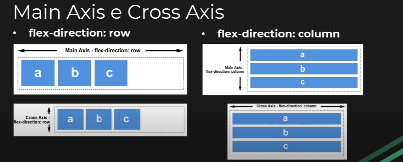

# O que é Flexbox?
* Flexible Box Model
* Aplicamos com display: flex
* Organização dos nossos layouts se torna mais flexível e dinâmica
* Por padrão, todos os itens do container ficam lado a lado
* Grande capacidade de responsividade

## Direção dos itens (flex-direction)
* row (padrão): posiciona os itens lado a lado
* column: posiciona os itens um embaixo do outro

## Main Axis e Cross Axis (eixo principal e eixo transversal)
* flex-direction: row
    - Main Axis: eixo horizontal
    - Cross Axis: eixo vertical
* flex-direction: column
    - Main Axis: eixo vertical
    - Cross Axis: eixo horizontal
* Esquema:

## Formas de alinhamento (justfy-content)
* justify-content: alinha os itens no Main Axis
    - flex-start: alinha os itens no início do container (padrão)
    - flex-end: alinha os itens no final do container
    - center: alinha os itens no centro do container
    - space-between: distribui os itens igualmente no container
    - space-around: space-between com margem dos lados

## Formas de alinhamento (align-items)
* align-items: alinha os itens no Cross Axis
    - stretch: faz com que os itens cresçam igualmente (padrão)
    - flex-start: alinha os itens no início do container
    - flex-end: alinha os itens no final do container
    - center: alinha os itens no centro do container.

## Formas de alinhamento (align-content)
* align-content: alinha as linhas do container verticalmente (tanto flex-direction do column quanto do row)
    - stretch: faz com que os itens cresçam igualmente (padrão)
    - flex-start: alinha as linhas do início do container
    - flex-end: alinha as linhas no final do container
    - center: alinha as linhas no centro do container
    - space-between: distribui as linhas igualmente no container
    - space-around: space-between com margens verticais

## Responsividade (flex-flow)
* Com a propriedade flex-flow podemos adicionar responsividade ao nosso layout de uma forma muito simples
* Seus valores:
    - nowrap: não permite a quebra de linha
    - wrap: quebra a linha assim que um dos itens não couber nela
    - wrap-reverse: mesma coisa que o wrap, mas a quebra acontece para a linha acima.

## Algumas propriedades do flex-item (para os itens do container)
* order: define a ordem do elemento no container 
* flex: define o tamanho do elemento no Main-Axis baseado no tamanho do container (divide em frações baseado no tamanho do container)
* flex-basis: define o tamanho do elemento baseado no Main-axis
* align-self: semelhante ao align-itens, so que vai alinha um unico item do container em relação ao Cross-Axis
    - stretch (padrão)
    - flex-start
    - flex-end
    - center
    ...

## Conclusão
* Prática, prática e mais prática
* Pesquise mais sobre o Flexbox (ex: no MDN)
