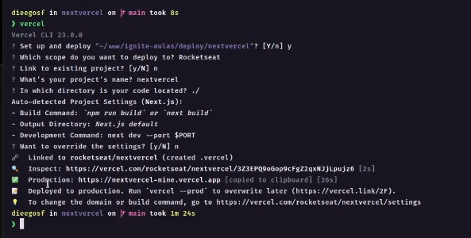

# Publicando na Vercel
Para publicar(fazer deploy) sua aplicação na Vercel há duas maneiras:

* Através do proprio site da Vercel, onde os passos são bem intuitivos basta acessar: https://vercel.com
* Através do `vercel-cli`, que basicamente é o vercel para seu pc, onde podemos enviar dados para sua conta vercel através do terminal, para instalar o vercel-cli execute `npm i -g vercel` ou `yarn global add vercel`, após isso siga os seguintes passos para publicar sua aplicação na vercel com o vercel-cli:
    - `vercel login`: logar na sua conta vercel
    - `vercel`: iniciar/criar seu projeto na vercel (execute dentro do diretorio principal do seu projeto), serão realizadas algumas perguntas que bem intuitivas de responder).
        - Ex: 
    - Agora basta acessar sua conta da vercel para ver o deploy da sua aplicação criado, lá você pode lincar o deploy da sua aplicação com o repositório correspondende no seu GitHub, entre outras funcionalidades.